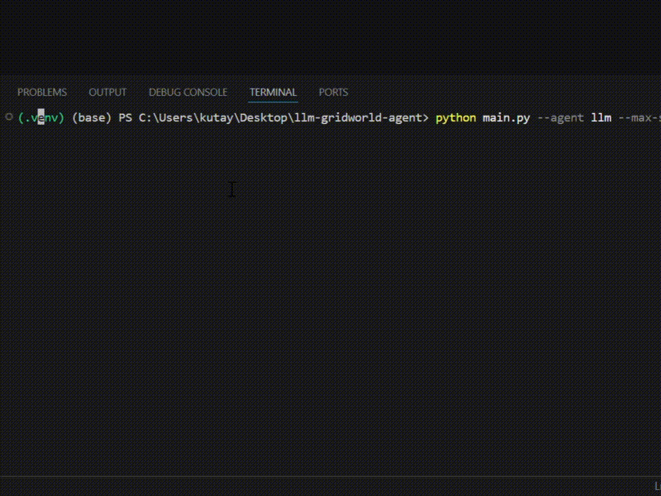
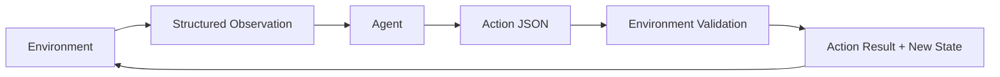

# LLM GridWorld Agent

A deterministic 2D GridWorld where a Gemini-based LLM agent learns to find a key, open a door, and reach a goal — built to test the harness between LLMs and environments, not the world itself.

It includes structured observations, JSON-only action selection, retry/fallback handling, observation-only memory, and a deterministic BFS mock agent that runs without an API key.

The same harness principles — structured observations, validated action spaces, retry/fallback handling, and observation-only memory — generalize to embodied agents controlling physical systems.

> Goal: find the key, open the locked door, and reach the goal tile.

---

## Demo

The GIF below shows a full 27-step Gemini LLM run from start to `goal_reached`.



Full logs:

- [`examples/demo_log.md`](examples/demo_log.md): human-readable step trace
- [`examples/llm_run.json`](examples/llm_run.json): structured LLM run log
- [`examples/mock_run.json`](examples/mock_run.json): structured mock agent run log

---

## Quickstart

Run the deterministic mock agent without an API key.

To run the LLM agent, see [Running the Gemini LLM Agent](#running-the-gemini-llm-agent) below.

### macOS/Linux

```bash
git clone https://github.com/KutayStudy/llm-gridworld-agent.git
cd llm-gridworld-agent
python -m venv .venv
source .venv/bin/activate
pip install -r requirements.txt
python main.py --agent mock
```

### Windows PowerShell

```powershell
git clone https://github.com/KutayStudy/llm-gridworld-agent.git
cd llm-gridworld-agent
python -m venv .venv
.venv\Scripts\Activate.ps1
pip install -r requirements.txt
python main.py --agent mock
```

---

## Default World

```text
##########
#A..K....#
#..##....#
#....#...#
#..D.#.G.#
#........#
##########
```

Legend: `A` = agent, `K` = key, `D` = locked door, `G` = goal, `#` = wall, `.` = empty tile.

The world is intentionally simple. The project focuses on the interface between an LLM agent and an environment: observation, action selection, validation, memory, and logging.

---

## Agent-Environment Loop



The agent receives observations and returns actions. The environment validates every action before updating state.

---

## Project Structure

```text
src/        environment, actions, observations, agents, LLM client, renderer, logger
examples/   sample observation/action, mock run, LLM run, Markdown demo log
tests/      action parsing and environment rule tests
assets/     demo GIF
```

---

## Observation Format

At every step, the environment returns a structured observation.

Example:

```json
{
  "step": 4,
  "position": [1, 4],
  "current_tile": "key",
  "inventory": [],
  "goal": "Find the key, open the locked door, and reach the goal tile.",
  "current_objective": "go_to_key",
  "target_position": [1, 4],
  "allowed_actions": [
    "MOVE_UP",
    "MOVE_DOWN",
    "MOVE_LEFT",
    "MOVE_RIGHT",
    "PICK_UP",
    "OPEN_DOOR",
    "WAIT"
  ],
  "visible_radius": 2,
  "visibility_mode": "radius_based",
  "visible_tiles": [
    {
      "direction": "east",
      "relative_position": [0, 1],
      "absolute_position": [1, 5],
      "type": "empty"
    }
  ],
  "last_action": "MOVE_RIGHT",
  "last_action_result": "success",
  "door_open": false,
  "done": false
}
```

A full sample observation is available in [`examples/sample_observation.json`](examples/sample_observation.json).

The Gemini LLM agent enriches the raw observation with its own memory before sending it to the model. This memory is built only from previous observations and action results.

It tracks:

- Visited positions
- Recent positions
- Known walls
- Known empty tiles
- Blocked moves
- Key, door, and goal positions

---

## Action Space

The supported actions are:

```text
MOVE_UP
MOVE_DOWN
MOVE_LEFT
MOVE_RIGHT
PICK_UP
OPEN_DOOR
WAIT
```

Expected LLM response:

```json
{
  "action": "MOVE_RIGHT",
  "reason": "The key is visible to the east."
}
```

A sample action response is available in [`examples/sample_action.json`](examples/sample_action.json).

---

## Environment Rules

The environment enforces task and physics rules:

- The agent cannot move through walls.
- The locked door blocks movement until opened.
- The agent can pick up the key only when standing on the key tile.
- Opening the door requires the key and adjacency to the door.
- The opened door can be crossed.
- The goal is completed only after the door has been opened.
- Every action produces a structured result such as `success`, `blocked_by_wall`, `picked_up_key`, `opened_door`, or `goal_reached`.

Invalid or physically impossible actions do not corrupt the environment state.

---

## LLM Prompt Design

The Gemini LLM agent is instructed to return valid JSON only:

```json
{
  "action": "MOVE_RIGHT",
  "reason": "short explanation"
}
```

The system prompt describes:

- The deterministic grid-world setting
- The allowed action space
- Movement restrictions
- Key pickup rules
- Locked door rules
- Goal completion behavior
- The requirement not to invent unsupported actions

The full prompt is available in [`src/llm/prompts.py`](src/llm/prompts.py).

---

## Running the Gemini LLM Agent

The mock agent does not require an API key. The Gemini LLM agent does.

Copy `.env.example` into `.env` and add your Gemini API key:

```env
GEMINI_API_KEY=your_api_key_here
```

Run the LLM agent:

```bash
python main.py --agent llm --max-steps 50
```

Run with JSON and Markdown logging:

```bash
python main.py --agent llm --max-steps 50 --log-file examples/llm_run.json
```

This writes:

```text
examples/llm_run.json
examples/demo_log.md
```

---

## Example Output

Successful LLM run summary:

```text
Run summary
Agent: llm
Completed: True
Total steps: 27
Invalid actions: 0
Saved run log to examples\llm_run.json
Saved demo log to examples\demo_log.md
```

Key task events:

```text
PICK_UP    -> picked_up_key
OPEN_DOOR  -> opened_door
MOVE_RIGHT -> goal_reached
```

The saved LLM run demonstrates one complete execution: `goal_reached` in 27 steps with 0 invalid actions. A formal success-rate evaluation over multiple maps or random seeds is listed as future work.

---

## Design Choices

### 2D Grid World

I chose a 2D grid because it is easy to inspect, debug, render in the terminal, and validate deterministically. The focus is the agent-environment harness rather than visual complexity.

### Small Action Space

The action space is intentionally small so model output can be validated reliably. This makes the loop easier to inspect and prevents unsupported actions from entering the environment.

### No `LOOK` Action

There is no separate `LOOK` action because the environment returns a structured observation at every step.

### Environment-Level Validation

The environment validates every action. If the agent tries to move into a wall, the environment returns `blocked_by_wall` and keeps the state unchanged.

### Mock Agent

The deterministic BFS mock agent is included so the project can be tested without an API key.

### Model Selection

The LLM client currently uses `gemini-3.1-flash-lite-preview`, selected for lightweight agentic runs where latency and cost matter. This fits the project goal: testing an agent-environment control loop rather than maximizing raw reasoning depth.

This is also relevant for embodied-agent systems, where fast perception-action loops are often more useful than slow, heavy reasoning calls.

### Gemini LLM Agent Memory

The LLM agent maintains an internal memory map built only from observations and action results. This helps it avoid repeated mistakes while preserving the environment-observation boundary.

---

## What Worked / What Didn't

### What Worked

Structured observations and constrained actions made the loop reliable. The validation layer prevented invalid model output from corrupting environment state.

This validate-then-update pattern is also important for embodied agents, where unsafe or invalid actions in a physical system cannot simply be undone.

The same patterns — observation-only state estimation, action-space constraints, and per-step validation — are core primitives for agents that act in simulated or physical environments.

The mock agent was useful for verifying that the environment rules and task completion logic worked before adding the LLM layer.

The LLM agent became more reliable after adding:

- Explicit rules in the system prompt
- JSON extraction
- Retry logic
- Safe fallback action
- Observation-based memory
- Blocked-move tracking
- Anti-oscillation behavior

### What Didn't Work

Initial prompts allowed the model to attempt physically invalid actions, such as opening the door before standing next to it. I addressed this by making the rules explicit and keeping environment-level validation.

LLM responses were not always valid JSON, so I added JSON extraction, retry logic, and a safe fallback action.

The LLM sometimes repeated locally successful but globally unhelpful moves, such as moving back and forth between two tiles. I addressed this by giving the agent memory over recent positions and blocked moves.

The model also occasionally tried to move directly toward a target through walls. The environment rejected these moves, and the agent used the feedback to update its internal memory.

Most of these issues took a few iterations of prompt tweaking and adding small safeguards in the agent wrapper, rather than a single clean fix.
---

## Tests

Run:

```bash
pytest
```

The test suite covers action parsing, allowed actions, wall and locked-door collisions, key pickup, door opening rules, wait behavior, and goal completion logic.

Current result:

```text
16 passed
```

---

## Known Limitations & Future Work

- Visibility is radius-based rather than wall-aware line-of-sight.
- The world is small and deterministic.
- LLM runs depend on external API availability and latency.
- Future improvements include procedural maps, multiple task types, token/cost tracking, planning mode, success-rate evaluation over multiple seeds, and a web replay viewer.

---

## License

MIT License.